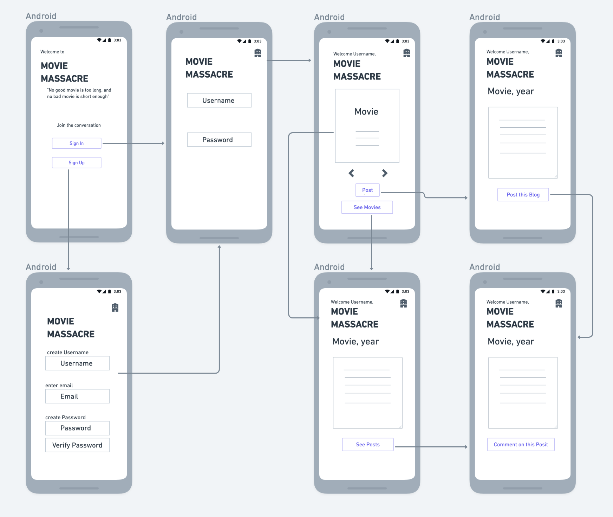
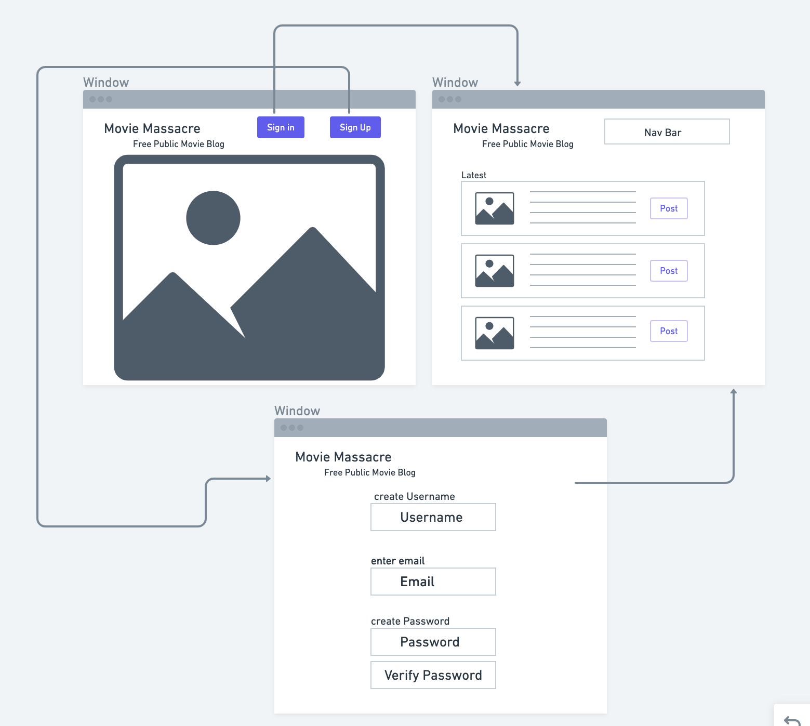
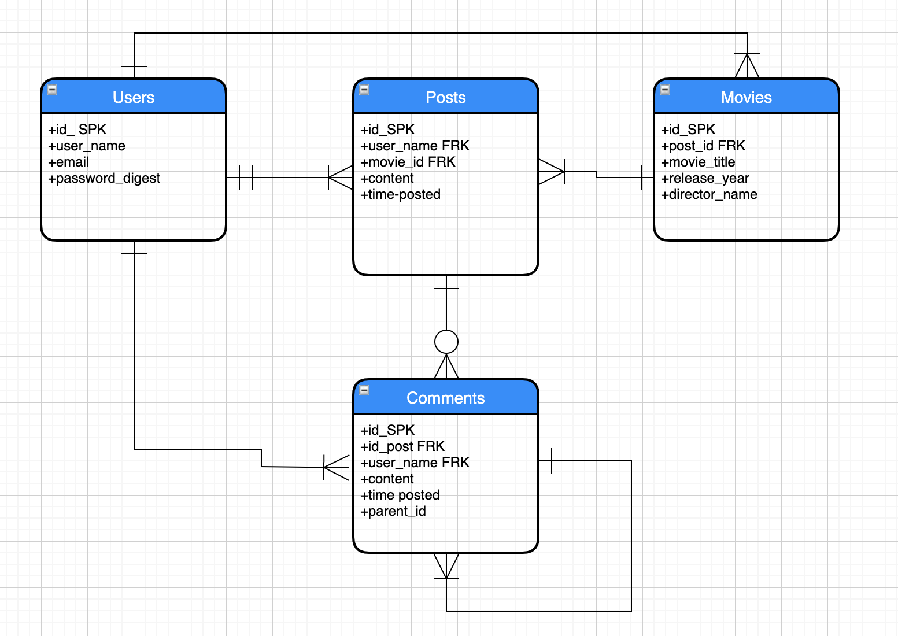

# MovieMassacre
<!-- //Description of the project you'll be building with the objective described in non-technical language -->
MovieMassacre is a fully functional fullstack CRUD app including authentication and authorization, utilizing ruby on rails for the back end, and REACT for the front end. 

### MovieMassacre is a Blog site for cinephiles. 
Have an opinion about a movie you've seen? who doesn't? Take to the internet to respectfully share that opinion with others, and, through other's posts and comments, get to know what others think, as well as what they think about your opinions, in what will be an intelligent and collected dialogue I'm sure. It was designed as part of the Mandalorians winter 2020 Software Engineering Immersive cohort at General Assembly.

### MVP
* This project includes authentication and authorization capability.
* Is created with a rails Backend and REACT frontend.
* Has models for users, movies, posts and comments, with appropriate interconnections to one another
* Is styled using FlexBox
* And includes CRUD operations:
Users: creating users, logging in, persistent login, logging out, displaying user information.
Posts: authrorized/restricted creating, updating, displaying, deleting of posts.

## Post MVP
* Use React-Bootstrap Material UI 
* Animation effects for certain clicks
* Images for movies
* Clips of movies where available
* Interacting 404 page as well as a loading icon/page

# Wireframes
Mobile:

Laptop:

# ERD:
