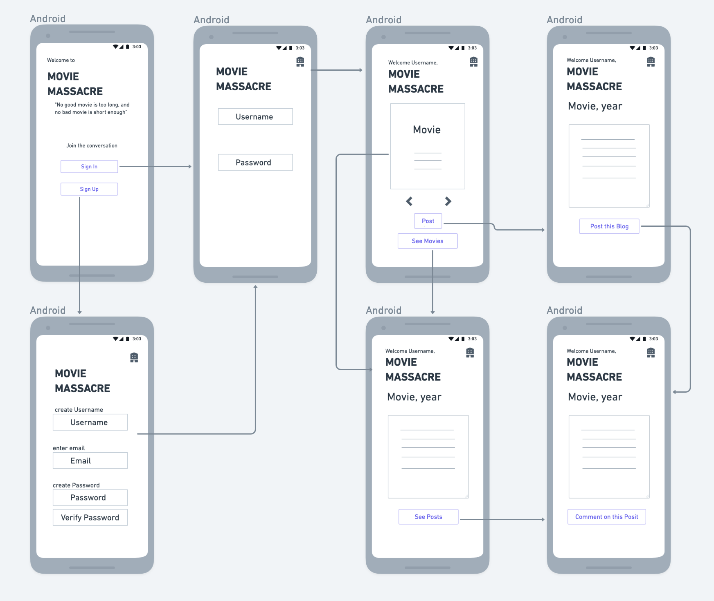

# MovieMassacre
<!-- //Description of the project you'll be building with the objective described in non-technical language -->
MovieMassacre is a fully functional fullstack CRUD app including authentication and authorization, utilizing ruby on rails for the back end, and REACT for the front end. 

### MovieMassacre is a Blog site for cinephiles. 
Have an opinion about a movie you've seen? who doesn't? Take to the internet to respectfully share that opinion with others, and, through other's posts and comments, get to know what others think, as well as what they think about your opinions, in what will be an intelligent and collected dialogue I'm sure. MovieMassacre is a site to freely share your opinons through posts and comments, about movies and how they make us feel.
It was designed as part of the Mandalorians winter 2020 Software Engineering Immersive cohort at General Assembly.

This app was created using sseveral technologies, including; React/React Router for front-end data rendering, cors and bcrypt for authentication, and  Ruby and rails for backend, database migration and maintenance.


### MVP
* This project includes authentication and authorization capability.
* Is created with a rails Backend and REACT frontend.
* Has models for users, movies, posts and comments, with appropriate interconnections to one another
* Is styled using FlexBox
* And includes CRUD operations:
Users: creating users, logging in, persistent login, logging out, displaying user information.
Posts: authrorized/restricted creating, updating, displaying, deleting of posts.

## Post MVP
* Use React-Bootstrap Material UI 
* Animation effects for certain clicks
* Images for movies
* Clips of movies where available
* Interacting 404 page as well as a loading icon/page

## Wireframes

# Mobile:


# Laptop:


# ERD:


### 🗒️ Component Hierarchy:
```
Home Page
  |__ Log In
  |__ Sign Up
      |__ SignUP page
  |__ Movies_page 
      |__ Posts Page
           |__ comments
           |__ Subcomments
```

*Expected Challenges
As my first fullstack app using ruby on rails, I am excited to understand how I can implement authorization parameters to create a more seemless user experience for those logged in to the site vs those who are not, as well as the differences in the capabilities of a user who was access/privelage and a user who does not. Also, implementing changes in state in the front end, to reflect changes in state in the back end for a logged in user. 